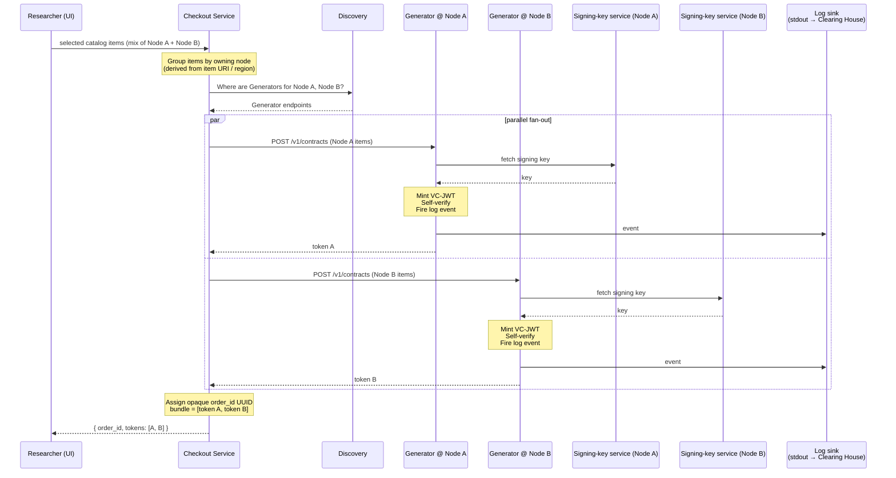
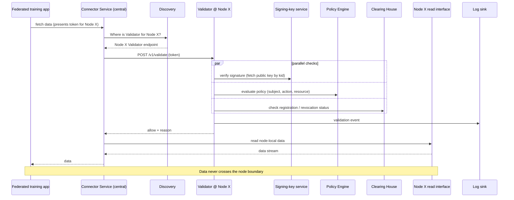
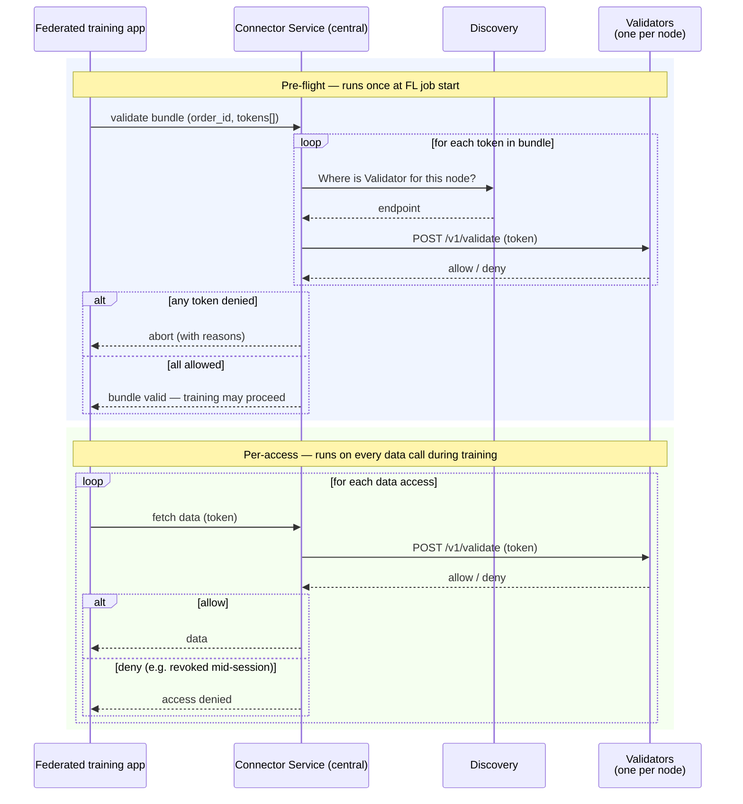
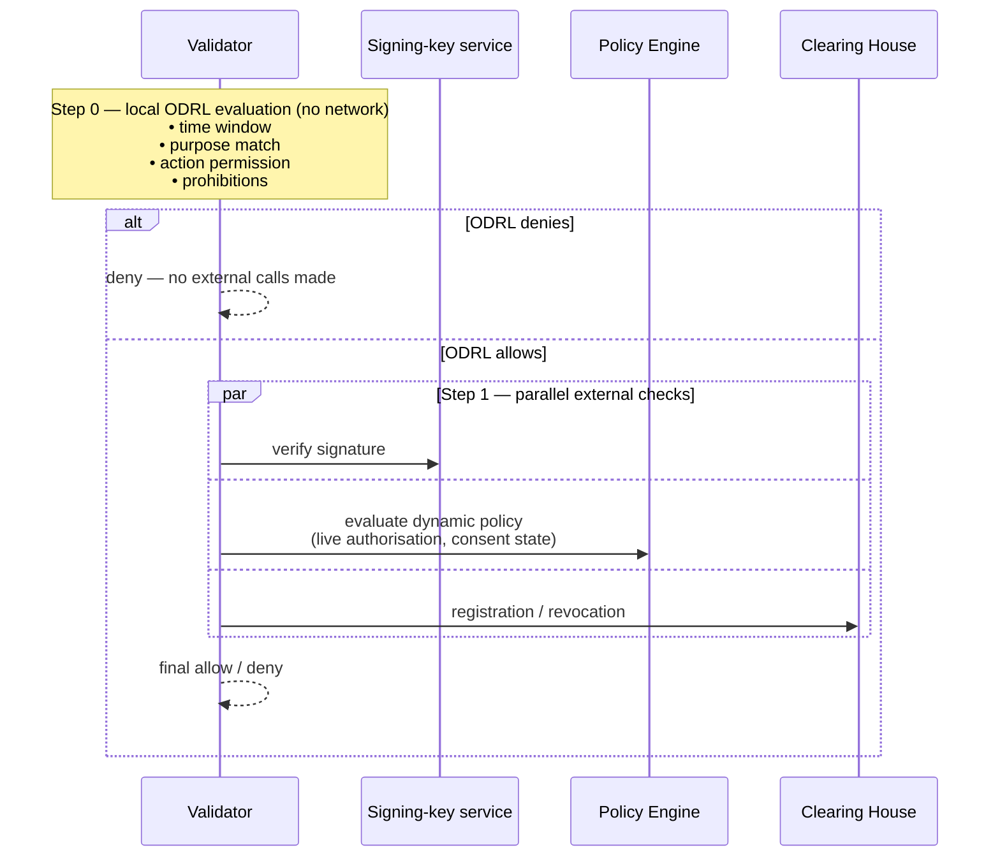
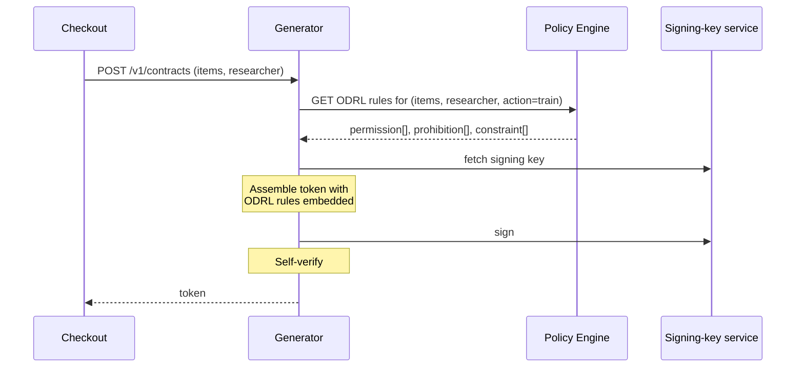

# Contract Engine — Research and Design

**Status:** Research deliverable · decisions pending
**Scope:** `ds-contract-generator` (DS-306) and `ds-contract-validator` (DS-307)
**Date:** 2026-04-23

---

## In short

The Contract Engine is a pair of stateless microservices — a **Generator** and a **Validator** — that issue and verify signed access contracts for federated data and applications inside a NextGen Node.

A researcher selects catalog items from a Marketplace. For each owning node, a local Generator mints one **VC-JWT** token covering that node's items. A **Checkout Service** assembles those tokens under an opaque **`order_id`** UUID and hands the bundle to the researcher's federated-training pipeline. When the pipeline needs data, a central **Connector Service** consults a **Discovery** system to find the owning node's local Validator, which runs signature, policy, and registration checks before allowing the Connector to fetch node-local data. Data never leaves the node that owns it.

Key choices:

- **Stateless compute** — Generator and Validator remember nothing between calls.
- **Logs-only persistence** — events go to pod logs today, to a clearing-house or downstream service later. Same code path.
- **VC-JWT as the token format** — JWT on the wire, W3C Verifiable Credential data model inside. Two variants presented for decision (§5).
- **One contract per node** — each Generator signs one token bundling all of that node's selected items. No federation-level super-contract.
- **Opaque `order_id` UUID** — the only correlation key that ties sibling sub-contracts together across nodes. Reveals nothing on interception.
- **TTL synced with the order** — the contract expires when the Checkout order expires, keeping tokens short-lived and revocation cheap.

Items marked *Decision pending* below remain open.

---

## Table of contents

1. [Scope and placement](#1-scope-and-placement)
2. [Core design decisions](#2-core-design-decisions)
3. [Creation flow — contract generation](#3-creation-flow--contract-generation)
4. [Validation flow — two variants](#4-validation-flow--two-variants)
5. [Token format — VC-JWT](#5-token-format--vc-jwt)
6. [Per-node aggregation and `order_id`](#6-per-node-aggregation-and-order_id)
7. [Key management and signing](#7-key-management-and-signing)
8. [Security properties](#8-security-properties)
9. [Known risks and trade-offs](#9-known-risks-and-trade-offs)
10. [Open questions](#10-open-questions)
11. [Decision log](#11-decision-log)
12. [Glossary](#glossary)

---

## 1. Scope and placement

**In short:** The Contract Engine sits between selection (Marketplace) and consumption (federated training / data access). It is the service that converts "the researcher has picked these items" into signed, verifiable, revocable access contracts.

The Contract Engine has two parts:

- **Contract Generator (`ds-contract-generator`, DS-306)** — mints new contracts when a researcher selects catalog items and wants to start a federated-training pipeline.
- **Contract Validator (`ds-contract-validator`, DS-307)** — verifies existing contracts before the Connector Service fetches node-local data.

Both are supplementary services to the surrounding platform:

- **Generator** is called by the **Checkout Service** after a researcher selects catalog items from the Marketplace.
- **Validator** is called by the central **Connector Service** before it fetches data from any node.

A **Discovery** system is used throughout — Checkout consults it to find each node's Generator endpoint; Connector consults it to find each node's Validator endpoint. Nodes can be added or moved without callers knowing about the topology.

The Contract Engine is part of the NextGen Pathfinder architecture (see the platform design and architecture blueprint, §4.5.9) and contributes to both the *Federated analysis* and *Cross-Border Data Access and Interoperability* capability groups.

---

## 2. Core design decisions

### 2.1 Stateless compute

**In short:** Neither Generator nor Validator holds state between calls. Any pod serves any request.

No session affinity. No local database. Signing keys are fetched from a signing-key service (typically the platform's auth service) at request time, not held in memory across restarts.

This matches plain Kubernetes deployment patterns — scaling, rolling updates, and pod crashes all "just work" with standard Deployments. Caches, when introduced later for performance, sit *alongside* the service as an optimisation, not inside its logic. If a cache is lost, validation still works — pods just go slower until it warms back up.

### 2.2 Logs-only persistence

**In short:** The services do not own a database. They emit events.

- **Today:** structured events to stdout, collected by the cluster's pod-log stack.
- **Later:** events pushed to the Clearing House (when it is built) or to the respective downstream service. The emission call is fire-and-forget — the hot path never blocks on the audit sink.

What this rules out:

- No audit database inside Contract Engine.
- Contracts themselves are not retained centrally — the researcher holds the signed token; audit records reference it by `jti` and hash.

The tamper-evidence limitation of pod logs is acknowledged in §9.5.

### 2.3 VC-JWT as the contract format

**In short:** Contracts are issued as W3C Verifiable Credentials encoded as JSON Web Tokens.

A VC-JWT is three base64url-encoded parts joined by dots — header, payload, signature. The payload's `vc` claim carries the W3C Verifiable Credential data model. Standard JSON Web Token libraries are enough to issue and verify; no JSON-LD processing is required in the hot path.

Why not plain JWT: the VC data model gives us a standard place to attach revocation pointers (StatusList2021), a clean issuer/subject structure, and alignment with European dataspace initiatives (EBSI, Gaia-X health pilots, upcoming EHDS tooling).

Why not full JSON-LD VC: the JSON-LD tooling is heavier, the readability cost hurts day-to-day development, and the linked-data features that justify it are not needed here.

A simplified non-VC variant is presented alongside in §5.4 for decision.

### 2.4 One contract per node

**In short:** Each owning node's Generator mints one VC-JWT covering all of that node's selected items. Not one token per item.

If a researcher picks three items from Node A and two from Node B, the bundle contains two tokens, not five. Each token's `credentialSubject.catalogItem[]` is an **array** listing the items on that token's node.

Why:

- Authority is node-local. Each node is the authoritative signer for its own data, so the natural signing unit is per-node.
- Fewer tokens — fewer network round-trips, fewer things to manage, smaller `order_id` bundles.
- Per-item revocation is rarely needed in practice. Per-node revocation is the meaningful unit: a node either participates in the research access or it does not.

This simplification is called out explicitly because the platform blueprint (D2.1 §4.6.4) describes a per-item signing model aggregated into a "Pipeline Contract". This design collapses that into per-node signing with no signed super-object; see §2.5.

### 2.5 No federation-level super-contract

**In short:** Per-node sub-contracts are held together only by an opaque `order_id` UUID. No signed super-contract exists.

No single party could legitimately sign "for all participating nodes" — there is no federation-level root of trust, by design. So the aggregation is application-level metadata, not a signed artefact.

**Transaction outcome** is computed after the fact by inspecting which sub-contracts have been consumed (successfully validated at least once during the session):

- All sub-contracts consumed → **done**
- Some consumed, some not → **partial**
- None or below a configured threshold → **failed**

The threshold policy is a property of the federated-training pipeline configuration, not the Contract Engine. See §9.4.

### 2.6 TTL synced with the order's lifetime

**In short:** The contract's `exp` equals the Checkout order's TTL.

Federated-training sessions are short — minutes to hours — and the contract exists only to authorise data access for that session. A short, synchronous TTL simplifies the revocation story (§9.2), keeps stale tokens from lingering, and means the operational assumption is "tokens are ephemeral, not portable artefacts the researcher stores long-term".

### 2.7 Centralised Connector, per-node everything else

**In short:** The Connector Service is one logical endpoint that any user hits. Generators and Validators are per-node. Discovery is the glue.

On every data-access request the Connector:

1. Reads the token, extracts the owning node identifier (from `credentialSubject.node` or the catalog item URI).
2. Consults **Discovery** for that node's Validator endpoint.
3. Calls the node's **local Validator** over REST.
4. On allow, fetches data through that node's local read interface and streams it back.

Generators are also per-node — each node's Generator signs only for its own data, using its own node's key. Discovery makes Checkout independent of where each Generator lives.

### 2.8 Primary verification at mint time

**In short:** Before a Generator ships a freshly-minted token, it verifies its own output.

Immediately after signing, the Generator:

1. Decodes the token it just produced.
2. Verifies the signature against the auth service's published public key.
3. Validates the payload shape against the expected JSON schema.
4. Only then returns to Checkout.

This adds roughly a millisecond to each mint and catches the vast majority of implementation bugs (bad key rotation, wrong schema, base64 mishandling) before a token ever reaches a consumer. Cheap insurance.

---

## 3. Creation flow — contract generation

**In short:** The researcher picks catalog items from the Marketplace; Checkout groups them by owning node, calls each node's Generator in parallel, collects the tokens, and returns a bundle keyed by an opaque `order_id`.



**Key points:**

- Fan-out is **parallel**. Total latency is set by the slowest Generator, not the sum.
- Each Generator signs only for its own node, using its own node's key. No cross-node signing.
- The **Discovery** lookup keeps Checkout decoupled from node topology — nodes can be added, moved, or replaced without Checkout needing to know.
- The `order_id` is an **opaque UUID** assigned by Checkout (not derived from the items, not a hash, not a sequence number). It reveals nothing on interception; see §6 and §8.
- `order_id` is embedded inside every sibling token (as an `orderId` claim), so per-node log events remain correlatable after the fact.

---

## 4. Validation flow — two variants

**In short:** The Validator is called before the Connector Service ever touches data. Two placement strategies exist — per-access-only, and pre-flight-plus-per-access. The second is recommended.

Both variants share the same four check types. The difference is *when* they run.

### 4.1 Variant V1 — per-access only

Validator is called once on every data access request.



**Pros of V1:**

- Simplest model. Every access is fresh.
- Catches mid-session revocation the moment it takes effect at the Clearing House.

**Cons of V1:**

- Every access pays the full validation cost on every call.
- A structurally broken token (bad signature, malformed claims) is not detected until the first data access — the researcher experiences a confusing mid-training failure rather than a clear startup error.

### 4.2 Variant V2 — pre-flight plus per-access (recommended)

Validator is called once at the start of the training job for every token in the bundle, then again on each subsequent data access.



**Pros of V2:**

- **Fails fast.** A structurally invalid token aborts the training job at startup, not mid-run.
- Catches mid-session revocation on every subsequent access, the same as V1.
- Clearer diagnostics — pre-flight failures are attributable to the bundle; per-access failures point at a specific revocation event.

**Cons of V2:**

- Two validation paths to implement and maintain.
- Pre-flight adds latency to training startup, proportional to the number of tokens in the bundle.

**Recommendation:** V2. The extra round-trips at startup are negligible compared to a federated-training run, and the failure semantics are much more useful for the researcher.

*Decision pending — the alternative V1 is perfectly workable if simplicity is prioritised over fail-fast diagnostics.*

---

## 5. Token format — VC-JWT

**In short:** A VC-JWT is three base64url-encoded parts joined by dots — header, payload, signature. Anyone who intercepts a token can decode its payload; nobody can modify or forge one without the issuing node's signing key.

### 5.1 Structure on the wire

```
<base64url(header)>.<base64url(payload)>.<base64url(signature)>
```

A single compact string. This is what Checkout receives from each node's Generator and returns to the researcher as one element of the `tokens` array.

### 5.2 Header

Declares how the token was signed.

```json
{
  "alg": "EdDSA",
  "typ": "JWT",
  "kid": "did:keri:EH7f...HUSnode#key-1"
}
```

| Field | Meaning |
|---|---|
| `alg` | Signing algorithm. `EdDSA` — the standard for the platform's decentralised identifiers. |
| `typ` | Token type — always `JWT`. |
| `kid` | Key identifier. Tells the Validator *which* public key to fetch from the signing-key service in order to verify the signature. The DID identifies the node; the fragment identifies the specific key. |

### 5.3 Payload — Variant A (W3C-compliant VC-JWT)

A worked example using a real catalog item (HUS synthetic GWAS dataset):

```json
{
  "iss": "did:keri:EH7f...HUSnode",
  "sub": "did:keri:EA92...researcher",
  "iat": 1745409600,
  "exp": 1745413200,
  "jti": "urn:nextgen:contract:f4c7a2b1-8d3e-4b9c-a1d2-e5f6a7b8c9d0",
  "orderId": "urn:nextgen:order:9d8e7c6b-5a4f-3e2d-1c0b-a9f8e7d6c5b4",

  "vc": {
    "@context": [
      "https://www.w3.org/ns/credentials/v2"
    ],
    "type": ["VerifiableCredential", "NextGenContract"],

    "credentialSubject": {
      "catalogItem": [
        {
          "id": "https://hus.nextgen.hiro-develop.nl/dataset-test-2907",
          "identifier": "synthetic_dataset_test_2907",
          "title": "GWAS on Cats 2907",
          "checksum": {
            "algorithm": "SHA-256",
            "value": "3a7bd3e2360a3b5c1b2ef3b1a4e8f7a6"
          }
        }
      ],

      "action": "train",
      "purpose": "federated-learning"
    },

    "credentialStatus": {
      "type": "StatusList2021Entry",
      "statusListIndex": "12345",
      "statusListCredential": "https://clearinghouse.nextgen.local/status/2026-Q2"
    }
  }
}
```

**Outer JWT envelope (standard claims):**

| Field | Meaning |
|---|---|
| `iss` | Issuer — the DID of the node that signed this contract. |
| `sub` | Subject — the DID of the researcher the contract is about. |
| `iat` | Issued-at — Unix timestamp when the token was minted. |
| `exp` | Expiry — Unix timestamp after which the token is rejected. Equals the Checkout order's TTL. |
| `jti` | JWT ID — the unique identifier for this contract. Used by the Clearing House for registration and revocation lookups. |
| `orderId` | The opaque `order_id` UUID this sub-contract belongs to. The correlation key across sibling sub-contracts and audit logs. |

**Inner `vc` claim:**

| Field | Meaning |
|---|---|
| `@context` | W3C Verifiable Credential vocabulary declaration. Not processed at validation time in the current design, but required for strict W3C VC compliance. |
| `type` | Declares this credential as both a generic `VerifiableCredential` and a specific `NextGenContract`. |
| `credentialSubject.id` | Subject DID (mirrors outer `sub` — required by the VC data model). |
| `credentialSubject.node` | The hostname of the owning node. |
| `credentialSubject.catalogItem[]` | **Array** of items this sub-contract grants access to on this node. Each item is bound by URI (`id`) plus SHA-256 checksum, so tampering of the underlying dataset is detectable. |
| `credentialSubject.action` | What the researcher is permitted to do — `train` (use in federated training), not `download`, `query`, or `extract`. |
| `credentialSubject.purpose` | Why — `federated-learning`. The Policy Engine evaluates this against the catalog item's attached policy. |
| `credentialStatus` | Pointer into the Clearing House's StatusList2021 bitmap. How the Validator checks revocation once the Clearing House is built. Placeholder for now. |

### 5.4 Payload — Variant B (simplified)

Drops the `@context` and the `VerifiableCredential` type marker. The token is no longer a strict W3C VC-JWT — it is a plain JWT carrying VC-shaped claims under a `contract` wrapper.

```json
{
  "iss": "did:keri:EH7f...HUSnode",
  "sub": "did:keri:EA92...researcher",
  "iat": 1745409600,
  "exp": 1745413200,
  "jti": "urn:nextgen:contract:f4c7a2b1-8d3e-4b9c-a1d2-e5f6a7b8c9d0",
  "orderId": "urn:nextgen:order:9d8e7c6b-5a4f-3e2d-1c0b-a9f8e7d6c5b4",

  "contract": {
    "type": "NextGenContract",

    "catalogItem": [
      {
        "id": "https://hus.nextgen.hiro-develop.nl/dataset-test-2907",
        "identifier": "synthetic_dataset_test_2907",
        "title": "GWAS on Cats 2907",
        "checksum": {
          "algorithm": "SHA-256",
          "value": "3a7bd3e2360a3b5c1b2ef3b1a4e8f7a6"
        }
      }
    ],

    "action": "train",
    "purpose": "federated-learning",

    "status": {
      "statusListIndex": "12345",
      "statusListCredential": "https://clearinghouse.nextgen.local/status/2026-Q2"
    }
  }
}
```

### 5.5 Variant A vs Variant B — trade-offs

| | Variant A (W3C-compliant) | Variant B (simplified) |
|---|---|---|
| Includes `@context` | Yes | No |
| Declares `VerifiableCredential` type | Yes | No |
| Wire size | +~100 bytes | Smaller |
| Interoperable with external VC verifiers (EBSI, Gaia-X, EHDS pilots) | Yes | No |
| Honest claim of "W3C VC-JWT" | Yes | No (it is JWT with VC-shaped claims) |
| Runtime cost | Zero (processed only if JSON-LD library is invoked) | Zero |
| Developer onboarding cost | Extra concept (`@context`, VC type marker) to explain | Minimal |
| Future-proofing for external federation | High — any W3C VC verifier can verify | Low — requires custom integration |

**Decision pending.** If external interoperability with the broader W3C VC ecosystem is in scope (likely, given the EHDS alignment intent), **Variant A**. If the priority is strict simplicity and no external VC-ecosystem claims, **Variant B**.

### 5.6 Signature

Raw bytes — base64url-encoded EdDSA signature over `base64url(header) + "." + base64url(payload)`. Approximately 64 bytes before encoding. Not human-readable; not JSON.

**Verification procedure:** the Validator fetches the public key identified by the header's `kid` from the signing-key service, recomputes the signature over `base64url(header) + "." + base64url(payload)`, and checks equality. If they match, the token is proven to have been signed by the key indicated by `kid` and not modified since.

### 5.7 Optional enrichment — ODRL usage rules

**In short:** W3C Verifiable Credentials pair naturally with ODRL (Open Digital Rights Language) for expressing usage rules inside the token itself. Adding ODRL is backward-compatible with Variant A and makes the token's rules self-describing, which reduces Policy Engine load on hot paths and opens the door to external verifiers evaluating the token without network access to NextGen.

#### What ODRL is

ODRL is a W3C standard vocabulary for expressing usage rules in a machine-readable form — what someone is allowed to do, what they are forbidden from doing, and under what conditions. It has four primitives:

| Primitive | Meaning | Example in this context |
|---|---|---|
| `permission` | What the subject is allowed to do | "may train" |
| `prohibition` | What the subject must not do | "must not extract", "must not distribute" |
| `obligation` | What the subject must do to keep a permission | (not currently used) |
| `constraint` | Conditional qualifier on a rule | "only if purpose = federated-learning", "only before 2026-04-23T13:00:00Z" |

#### What the enriched token looks like

ODRL sits inside `credentialSubject` alongside the existing fields. The `@context` gets one additional entry pointing at the ODRL vocabulary:

```json
"@context": [
  "https://www.w3.org/ns/credentials/v2",
  "https://www.w3.org/ns/odrl.jsonld"
],

"credentialSubject": {
  "id": "did:keri:EA92...researcher",
  "node": "hus.nextgen.hiro-develop.nl",
  "catalogItem": [ ... ],

  "permission": [
    {
      "action": "train",
      "constraint": [
        { "leftOperand": "purpose",  "operator": "eq",   "rightOperand": "federated-learning" },
        { "leftOperand": "dateTime", "operator": "lteq", "rightOperand": "2026-04-23T13:00:00Z" }
      ]
    }
  ],
  "prohibition": [
    { "action": "extract" },
    { "action": "distribute" }
  ]
}
```

The plain `action` and `purpose` fields from the base Variant A are superseded by the richer `permission[]` / `prohibition[]` structure.

Notably, the **"data never leaves the node"** guarantee is encoded directly as a `prohibition` on the `extract` action. An auditor reading the token sees the rule explicitly, rather than inferring it from the architecture.

#### Benefits

1. **Self-describing tokens.** A reviewer, auditor, or external verifier can read a token and know exactly what it permits and forbids, without calling back to the Policy Engine API.
2. **Portable rule evaluation.** Any W3C VC verifier — including tools outside NextGen — can evaluate the token's rules on its own. This matters for future federation with other EU dataspace initiatives (EBSI, Gaia-X, EHDS pilots).
3. **Reduced Policy Engine load.** Time-window checks, purpose matching, and action/prohibition matching can be evaluated locally by the Validator from the ODRL rules, skipping Policy Engine round-trips for static violations.
4. **Fail-fast on the hot path.** A stale token (time window expired) or mis-used token (wrong purpose) is rejected locally without any network calls. Saves latency on clearly invalid requests.
5. **Standards alignment.** ODRL is the expected companion of W3C VCs in every major VC tooling ecosystem. Adopting it now keeps that door open without disrupting the current design.
6. **Explicit rule provenance.** The core architectural guarantees of the system are encoded in the token itself, not just in code or documentation. This is useful for compliance reviews.

#### Costs

1. One additional dialect for the team to learn and evaluate.
2. A small ODRL evaluation library in the Validator (or a hand-written subset evaluator — in practice only 3–5 ODRL operators are used).
3. Tokens grow by a few hundred bytes.
4. Risk of drift between rules encoded in ODRL inside tokens and policies held in the Policy Engine, if the two are not kept in sync.

#### Impact on the validation flow

Without ODRL (current design), the Validator runs three parallel external checks on every validate call: signature verification, Policy Engine evaluation, and Clearing House registration lookup.

With ODRL, a **local ODRL evaluation step runs first** (no network calls), and the Policy Engine is then consulted only for rules that cannot be expressed statically in the token:



**What changes compared to the non-ODRL flow:**

- A new **Step 0** — purely local evaluation. For clearly-invalid tokens, this returns deny without any network calls. Saves one full round-trip set per bad request.
- The **Policy Engine's scope narrows** — it is still called on the happy path, but only for rules that cannot be baked into the token at mint time: live authorisation state, consent withdrawal status, runtime attributes that may have changed since issuance.
- Signature and Clearing House calls are unchanged.

**Clear separation of concerns:**

| Where the rule lives | What kind of rule |
|---|---|
| **In the token (ODRL)** | Static rules known at mint time — time windows, declared purpose, action permissions, structural prohibitions (`extract`, `distribute`). |
| **In the Policy Engine** | Dynamic rules — live consent state, user role changes, runtime authorisation updates, access revocation. |

**Trade-off to manage:** if a static rule in the token drifts from reality (for example, a catalog item's policy is tightened after the token was minted), the token still says "allowed" for the old rule. Mitigations:

- Keep ODRL rules in the token limited to facts that do not change during a token's short lifetime. Short TTLs (§2.6) make this safe.
- Put all mutable rules only in the Policy Engine, never in the token.
- Treat the Policy Engine's decision as authoritative when both are consulted — ODRL can only *narrow* the allow-set, never *widen* it beyond what the Policy Engine permits.

#### Where the ODRL rules come from

The **Policy Engine** is the natural source. It holds the authorisation rules in its own internal format already; adopting ODRL simply gives it one additional capability — emitting those rules in ODRL form when asked.

The Generator gains one extra call at mint time:



Why Policy Engine is the right source:

- **Single source of truth.** Rules already live in Policy Engine; asking it to serialise them as ODRL avoids a second authoritative store that could drift.
- **Rules reflect full context.** Policy Engine knows the researcher's roles, the catalog item's attached policy, and any node-level overrides. It produces the right ODRL for the specific request, not a generic template.
- **Policy Engine retains authority.** The ODRL embedded in the token is a signed snapshot. The Policy Engine remains authoritative for dynamic re-evaluation at validate time — this is what the validation-flow diagram earlier in this section shows.

Alternative sources considered:

| Where ODRL originates | Pros | Cons |
|---|---|---|
| **Policy Engine emits at mint time** *(recommended)* | Single source of truth; rules reflect full context; no duplication | One extra call at mint time; Policy Engine needs an ODRL export capability |
| **Catalog item carries ODRL upfront** (embedded in DCAT-AP) | No Policy Engine call at mint time; data owner controls rules declaratively | Policy Engine and catalog could drift; not all DCAT profiles support ODRL natively |
| **Checkout supplies ODRL in the request** | Generator stays pure-signing | Pushes the Policy Engine integration upstream to Checkout; same single-source issue; complicates Checkout |

Mint-time is not on the hot path, so the extra round-trip for the recommended approach is acceptable.

#### Decision

Adding ODRL is a **pure payload enrichment** — no architectural change, no new service. It can be introduced after the base design is implemented, without breaking anything. Whether to include it now or later is a decision point tracked in §10.

---

## 6. Per-node aggregation and `order_id`

**In short:** A researcher's intent to train across multiple nodes produces N signed sub-contracts (one per node), bound together only by an opaque `order_id` UUID assigned by Checkout. There is no signed super-contract.

### 6.1 Two layers of aggregation

- **Inside a token:** one sub-contract covers **all** items belonging to its node. The array of item references lives in `credentialSubject.catalogItem[]` (Variant A) or `contract.catalogItem[]` (Variant B).
- **Across tokens:** the Checkout-assigned `order_id` UUID ties sibling sub-contracts together. Every sub-contract token carries the same `orderId` claim.

Only one of these two layers is signed — the per-node level. The across-token aggregation is application-level metadata only.

### 6.2 Why `order_id` is an opaque UUID

Checkout generates `order_id` as a random UUID. It is not derived from the selected items, not a hash of the bundle, not a sequence number, not meaningful in any way.

This has useful security consequences:

- **Reveals nothing on interception.** An attacker who sees an `order_id` in a log, a URL, or a network capture learns only that an order exists — not which catalog items, which nodes, or which researcher is involved.
- **Reveals nothing about the tokens.** The binding between `order_id` and catalog items lives inside the *signed* tokens and the per-node audit logs — neither of which an attacker can forge.
- **Is an authorisation-gated lookup key.** Knowing the UUID does not grant access; presenting it to an authorised service does, and only after the service has checked the caller's credentials.

### 6.3 Reconstructing a transaction

With no signed super-contract, the only way to reconstruct a complete transaction — "which catalog items did the researcher access, on which nodes, with what outcomes?" — is to query the per-node audit logs for events carrying a matching `orderId`.

This makes `order_id` a first-class audit-correlation key. Every log event emitted by any component of the Contract Engine (Generator mint, Validator allow, Validator deny, Connector fetch) **must** carry the `order_id` for which it was issued.

Today that query spans cluster pod-log stacks. Once the Clearing House is built, it becomes a single indexed query.

---

## 7. Key management and signing

**In short:** Signing keys are not held inside the Contract Engine. A Generator fetches its node's active signing key from a signing-key service (typically the platform's auth service) at mint time. A Validator fetches the corresponding public key at validation time.

### 7.1 What the Contract Engine holds

- **No private keys.** Ever. Signing is delegated to the signing-key service.
- **No persistent per-request state.**
- **Optional public-key caches** with short TTLs for performance (public keys change rarely — hours-scale — so caching them is cheap and safe).

### 7.2 Signing (Generator side)

1. Generator receives `POST /v1/contracts` with the items to sign.
2. Generator assembles the VC-JWT header and payload.
3. Generator asks the signing-key service to sign `base64url(header) + "." + base64url(payload)` using the node's active signing key. The signing-key service returns the signature; the private key never leaves it.
4. Generator assembles the final token.
5. Generator runs the mint-time self-verification (§2.8).
6. Generator emits a log event.
7. Generator returns the token to Checkout.

### 7.3 Verifying (Validator side)

1. Validator receives `POST /v1/validate` with the token.
2. Validator parses the header, extracts the `kid`.
3. Validator asks the signing-key service for the public key matching `kid` (or reads from a short-TTL cache).
4. Validator recomputes the signature over `base64url(header) + "." + base64url(payload)` and checks equality.
5. If the signature is valid and the token has not expired, validation proceeds to the policy and revocation checks in parallel.

### 7.4 Key rotation

Rotation is handled by the signing-key service. A new signing key gets a new `kid` fragment; Validators fetch the correct public key by `kid` without needing to know about rotation events. Existing tokens signed with an older key continue to verify as long as the signing-key service still publishes that key's public half within the retention window.

---

## 8. Security properties

**In short:** Tokens are signed for integrity and authenticity, not encrypted for confidentiality. TLS protects tokens in transit. The payload is base64-decodable by anyone on the wire, but its contents are non-secret metadata.

### 8.1 What signing gives us

- **Tamper-evidence** — any modification to the header or payload breaks the signature. A Validator rejects the token.
- **Authenticity** — only the holder of the node's private key could have produced the signature. The signing-key service is the sole signer.
- **Non-repudiation** — the issuing node cannot later deny having issued a token that verifies against its published public key.

### 8.2 What signing does not give us

- **Confidentiality** — the payload is base64-decodable by anyone who sees the token. Catalog item URIs, the researcher's DID, and timestamps are all readable if a token is intercepted on the wire.

### 8.3 Why no payload encryption

The payload contents are non-secret metadata:

- `catalogItem[]` URIs and titles — metadata, not the actual dataset.
- Researcher and node DIDs — public identifiers, not credentials.
- Timestamps, `jti`, `orderId` — descriptive.

Adding JWE (encrypted JWT) would double the key-management surface (a separate encryption key distribution) for no real confidentiality gain. Transport is already secured by TLS. No payload-level encryption is introduced.

### 8.4 Transport security

Every API call runs over TLS:

- UI → Checkout
- Checkout → Discovery
- Checkout → Generator
- Generator → signing-key service
- Researcher → Connector (central)
- Connector → Discovery
- Connector → Validator
- Validator → signing-key service
- Validator → Policy Engine
- Validator → Clearing House
- Validator / Generator → Log sink

Tokens are never transmitted over plaintext channels.

### 8.5 Summary

Tokens are signed for integrity and authenticity; transport confidentiality is provided by TLS. Payload contents are non-secret metadata (URIs, DIDs, timestamps) — no encryption of the token itself is required.

---

## 9. Known risks and trade-offs

This section names the rough edges up-front so they get attention in design review rather than appearing as surprises later.

### 9.1 Idempotency — non-idempotent by design

**In short:** If a generation call fails transiently, the caller re-issues. Duplicate tokens, if ever created, are harmless.

The Contract Generator is **non-idempotent**. If a `POST /v1/contracts` call fails due to network glitch, timeout, or any other transient condition, the caller re-issues the request, producing a fresh contract with a new `jti`. No deduplication is attempted at the Generator side.

Duplicates, if they ever occur, cause no harm:

- Each carries its own `jti` and `iat`.
- Each registers independently with the Clearing House.
- The Validator only admits tokens that are presented; unused duplicates age out at their `exp`.

**No compensating cleanup is required.** This is an explicit design choice that keeps the Generator simple and stateless.

### 9.2 Revocation mid-flight

**In short:** A contract may need to be revoked after it is issued but before its `exp`. Five approaches exist; recommendations are staged by deployment phase.

Why revocation mid-flight matters: the data owner may withdraw consent, the researcher's credentials may be suspended, the node operator may take the dataset offline. The Validator must eventually start rejecting the revoked token — but *how fast* is a design choice.

#### Five approaches

| # | Approach | Revocation latency | Infrastructure cost |
|---|---|---|---|
| 1 | **TTL-only.** Wait for `exp`. Revoked tokens still validate until expiry. | Up to the TTL (minutes to hours) | None |
| 2 | **Pull on validate.** Validator asks the Clearing House "is `jti` still registered?" on every call. | Near-zero (one extra parallel call per validation) | Adds one network hop per validation |
| 3 | **StatusList2021 poll.** Validator pulls a revocation bitmap periodically; checks locally. | Bounded by poll interval (e.g. 30 seconds) | Low; standard W3C pattern |
| 4 | **Push-based invalidation.** Clearing House broadcasts revocation events; Validators subscribe. | Near-zero | Pub/sub infrastructure needed |
| 5 | **Hybrid.** Short TTL for most tokens, pull-on-validate for sensitive ones, push for ultra-sensitive. | Varies by class | Moderate; classifier logic |

#### Recommendations, staged

**Proof-of-concept (current phase): Approach 1 — TTL-only.**

Use a short TTL matching the federated-training session (typically one hour, never longer than the Checkout order's TTL). If a contract is revoked mid-session, it expires naturally before the session can re-access the data. Zero infrastructure cost. Acceptable given that training sessions are short by definition.

**First production hardening: Approach 2 — pull on validate.**

The Validator adds a Clearing House registration check as one of its parallel validation calls. Revocation latency drops to near-zero (it takes effect on the next validate call, which happens on every data access in Variant V2). Cost is one additional parallel network call per validation — already within the validation budget. No new infrastructure required beyond the Clearing House itself.

**If strong SLAs are imposed: Approach 4 — push-based invalidation.**

Stand up a pub/sub event bus on the Clearing House side. Every Validator subscribes to a revocation topic. Revocation events propagate in sub-second time. This is the right answer if regulatory or operational SLAs demand it, but it requires real infrastructure work — Kafka topic or equivalent, subscription management, eventual-consistency handling when the bus is briefly unavailable.

**Approach 3 — StatusList2021 polling** — is a useful middle ground if pull-on-validate adds too much hot-path latency. It keeps revocation decisions local to each Validator with a bounded staleness window.

**Approach 5 — hybrid** — is only worth building once classifications of token sensitivity emerge. Not applicable in the POC.

#### Signalling revocation to nodes

A recurring question: "when a contract is revoked, do we send some signal to the respective nodes?"

The answer depends on which approach is in use:

- Approaches 1, 2, 3: **No active signal.** Revocation is recorded at the Clearing House; nodes discover it either by waiting (1), by asking (2), or by polling (3).
- Approach 4: **Yes, active signal.** The Clearing House publishes a `contract_revoked(jti)` event to the bus, and every subscribed Validator picks it up. This is precisely the signalling mechanism described above.

The POC has no active signalling. When the Clearing House is built and SLAs firm up, the move to Approach 2 (and later Approach 4 if needed) introduces it.

### 9.3 Policy Engine re-verification

**In short:** Whether the Validator should call the Policy Engine on every validate, or trust the policy was checked at mint time, is a real design choice.

| Option | Behaviour | Trade-off |
|---|---|---|
| **(i) Check only at Generator** | Policy is evaluated at mint time; Validator trusts the token. | Fast validation. Policy changes between mint and consume are not caught. |
| **(ii) Check only at Validator** | Generator signs whatever is requested; Validator evaluates on each call. | Always fresh policy. Extra latency on the hot path. |
| **(iii) Check at both** | Mint-time for fail-fast, validate-time for drift. | Belt-and-braces. Duplicate work. |

**Recommendation: (ii).** In a federated setting where data owners can change policies independently of each other, the Validator *must* re-check at consumption time — otherwise stale permissions leak through. The latency cost is one parallel call, which is already in the validation budget.

*Decision pending.*

### 9.4 Partial-failure semantics — who owns the threshold

**In short:** If the bundle has N sub-contracts and only K of them validate successfully, is the overall transaction done, partial, or failed? The answer depends on the federated-learning algorithm, not on the Contract Engine.

- **Server-client federated learning** (federated averaging and similar) can tolerate client dropouts and produce a meaningful global model from a subset of clients. A minimum quorum is usually needed for statistical relevance, but it is rarely "all participants required".
- **Strict-synchronous peer-to-peer learning** (certain ring and all-to-all topologies) may require every participant in a round; a single missing peer halts the round.
- **Gossip-based decentralised learning** — designed for churn; tolerant of drop-outs.

The "is this partial result acceptable?" decision therefore lives in the **federated-training pipeline configuration**, not in Contract Engine. Contract Engine reports consumption events per sub-contract via the audit log; the training application decides, based on its own algorithm and configured quorum, whether the aggregate outcome is acceptable.

### 9.5 Pod logs are not tamper-evident

**In short:** The current log destination is the cluster's pod-log stack. This is not a tamper-evident audit surface.

Anyone with cluster admin access can modify or delete log entries. European Health Data Space Article 73 audit obligations expect tamper-evident logging of data access — this is a known gap in the proof-of-concept.

**Mitigation:**

- **Today:** accept the gap. Document that audit logging is interim and is not being claimed as a compliance surface.
- **Tomorrow:** route audit events to the Clearing House, which is intended to provide cryptographically tamper-evident append-only storage. The Contract Engine code path does not change — only the sink.

### 9.6 Catalog integrity

**In short:** Catalog items (DCAT-AP JSON-LD documents) are not themselves cryptographically signed in the current platform. A poisoned catalog entry could, in principle, trick a Generator into signing a contract for a dataset that does not exist or is mislabelled.

**Mitigations inside Contract Engine:**

- Bind catalog items by URI + SHA-256 checksum inside the signed token (§5.3). The contract then ties to a specific artefact; later tampering of the dataset is detectable when the Connector reads the data.
- The Connector verifies the checksum when reading data, not just at contract mint time.

**Full upstream signing of catalog items** is a platform-level concern outside the scope of this document. It would close the remaining gap (a poisoned catalog entry at the moment of selection) but is not something the Contract Engine can solve alone.

### 9.7 Token format upgrade path

**In short:** A version migration (for example VC-JWT v1 → v2) across in-flight tokens is cheap here because token lifetimes are short.

Candidate approaches:

- **Versioned token types** (`NextGenContract_v1`, `NextGenContract_v2`). Validators support both for a deprecation window; Generators mint only the newer version after rollout.
- **Rely on short TTLs.** A version bump simply stops producing the old format; the issued-token population ages out within the TTL (minutes to hours). No migration tooling needed.

The second approach is preferred precisely because the design already commits to short TTLs. Migration becomes a non-event.

### 9.8 Liability across nodes

**In short:** If Node B's Validator grants access to data that should have been revoked by Node A's Clearing House update (due to TTL lag under Approach 1 in §9.2), who is accountable?

This is a governance question, not a technical one. It is included here because it will surface in legal and ethical review, and the design should name it rather than hide it. The candidate accountability models (data owner / node operator / platform governance / researcher) are enumerated in §10 as an open question.

### 9.9 Why REST between Connector and Validator

**In short:** The Connector is central, the Validator is per-node — they are not co-located, so REST over TLS is the natural call shape.

Even if co-location were an option, a stable REST boundary is preferable because:

- The Validator may, in future, be called by components other than the Connector (pre-flight checks, admin tools, external verifiers).
- Versioning the Validator API is easier as an HTTP contract than as a library interface.
- Language-neutral — any component in the platform can call a REST endpoint without a specific SDK dependency.

---

## 10. Open questions

The following are not blockers for the design but remain decision-pending. Each lands in the decision log below once resolved.

1. **VC-JWT Variant A vs Variant B** — §5.5. The choice hinges on whether external interoperability with W3C VC verifiers is in scope.
2. **ODRL adoption** — §5.7. Whether to embed ODRL usage rules in the token now, later, or not at all. Requires the Policy Engine to emit ODRL and the Validator to evaluate a small ODRL subset locally.
3. **Policy Engine re-verification placement** — §9.3. Options (i) mint-time only, (ii) validate-time only, or (iii) both.
4. **Revocation propagation mechanism** — §9.2. Which staged approach (TTL, pull, poll, push, hybrid) fits the SLA at each phase.
5. **Revocation ownership** — who is authorised to revoke a live contract? Candidate models:
   - The data owner of any item covered by the contract (item-level withdrawal).
   - The node operator (node-wide withdrawal).
   - A platform-level governance role (administrative revocation).
   - The researcher themselves (self-cancellation).
   Governance policy question; affects which roles need access to the revocation API.
6. **Catalog item upstream signing** — §9.6. Out of scope for this document, but the answer affects how much trust the Generator can place in a catalog entry at mint time.

---

## 11. Decision log

*To be filled in as decisions are taken.*

| Date | Decision area | Choice | Rationale |
|---|---|---|---|
| YYYY-MM-DD | Validation placement | *(V1 / V2)* | |
| YYYY-MM-DD | VC-JWT variant | *(A / B)* | |
| YYYY-MM-DD | ODRL adoption | *(now / later / not at all)* | |
| YYYY-MM-DD | Policy Engine re-verification | *(i / ii / iii)* | |
| YYYY-MM-DD | Revocation mechanism (POC) | *(TTL / pull / poll / push / hybrid)* | |
| YYYY-MM-DD | Revocation mechanism (production target) | | |
| YYYY-MM-DD | Revocation ownership | | |

---

## Glossary

| Term | Plain meaning |
|---|---|
| **Contract Engine** | The pair of services — Generator (DS-306) and Validator (DS-307) — that issue and verify access contracts. |
| **Contract Generator** | The service that signs new contracts when a researcher selects catalog items. Stateless. One deployment per node. |
| **Contract Validator** | The service that verifies existing contracts before data is fetched. Stateless. One deployment per node. |
| **Checkout Service** | The component that groups selected catalog items by owning node, calls each node's Generator, and assembles the resulting tokens under an `order_id`. |
| **Connector Service** | The central data-access endpoint. Any data fetch goes through it; it routes fetches to the owning node's read interface after validation. |
| **Discovery** | The service lookup mechanism. Translates "Generator for Node X" or "Validator for Node X" into a callable endpoint. |
| **Marketplace** | The UI surface where researchers browse and select catalog items. |
| **Node** | A participating site in the federation. Owns its own catalog items, its own signing keys, and its own Generator and Validator deployments. |
| **Region** | The attribute on a catalog item that identifies which node owns it. Drives Checkout's grouping logic. |
| **Stateless** | Each request is self-contained; the service remembers nothing between calls. |
| **JWT** (JSON Web Token) | A signed token format. Three base64url-encoded parts joined by dots: header, payload, signature. |
| **VC-JWT** | A W3C Verifiable Credential encoded as a JWT. Same semantics as a full VC, but JWT mechanics on the outside. |
| **Verifiable Credential (VC)** | A W3C standard for cryptographically verifiable claims about a subject. |
| **`@context`** | A JSON-LD construct declaring which vocabularies a document uses. Required for strict W3C VC compliance; not processed at validation time in this design. |
| **DCAT-AP** | Data Catalog Vocabulary — Application Profile. The JSON-LD format used to describe catalog items in the platform. |
| **StatusList2021** | A W3C standard for representing revocation status across many credentials as a single bitmap. |
| **EdDSA** | The signing algorithm used for tokens in this design. Fast, compact, well-supported. |
| **DID** (Decentralised Identifier) | A URI-shaped identifier bound to a public key, used here to identify nodes and researchers. |
| **`kid`** | Key identifier. The token header field that tells the Validator which public key to fetch from the signing-key service. |
| **`jti`** | JWT ID. The unique identifier of a single contract. |
| **`order_id`** | The opaque UUID assigned by Checkout that ties sibling sub-contracts together across nodes. Reveals nothing on interception. |
| **Signing-key service** | The platform service (typically the auth service) from which Generators request signing and Validators request public keys. Private keys never leave it. |
| **Clearing House** | The planned tamper-evident log service. System of record for audit; source of truth for registration and revocation status. Not yet built. |
| **Policy Engine** | The existing platform service that holds and evaluates authorisation rules. Called by the Validator during the policy check. If ODRL is adopted (§5.7), also emits ODRL rule snapshots at mint time for embedding in tokens. |
| **ODRL** (Open Digital Rights Language) | A W3C vocabulary for expressing usage rules — permissions, prohibitions, obligations, constraints — in machine-readable form. Optional enrichment of the VC-JWT token payload; source of rules remains the Policy Engine. |
| **TTL** (Time To Live) | How long a token is valid before `exp`. Equal to the Checkout order's lifetime. |
| **Pre-flight validation** | Validating all tokens in a bundle once at the start of a federated-training job, before any data access. Variant V2. |
| **Per-access validation** | Validating a token on every individual data-access call. Part of both Variant V1 and V2. |
| **Fire-and-forget** | An asynchronous call where the sender does not wait for confirmation. Used for emitting log and audit events. |
| **Federated learning** | A machine-learning pattern where models are trained across multiple nodes without raw data leaving any node. Only model updates cross the network. |
| **Server-client FL** | A federated-learning topology where clients send updates to a central aggregator. Tolerant of client dropouts. |
| **Peer-to-peer FL** | A federated-learning topology where peers exchange updates directly. Tolerance of peer dropouts depends on the specific protocol. |

---

*End of document.*
